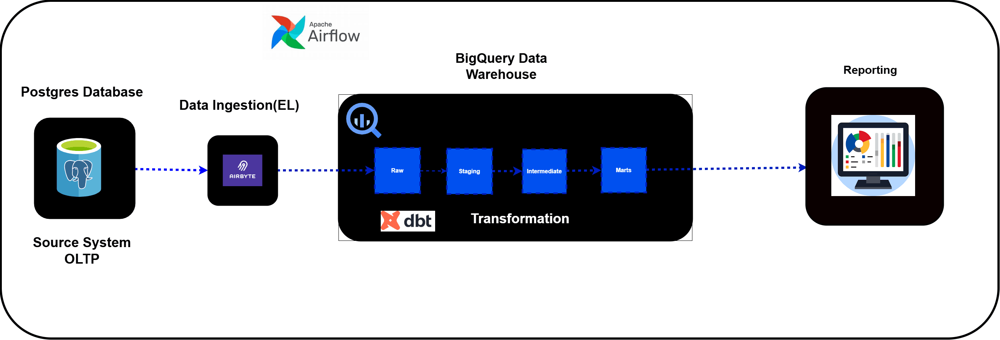
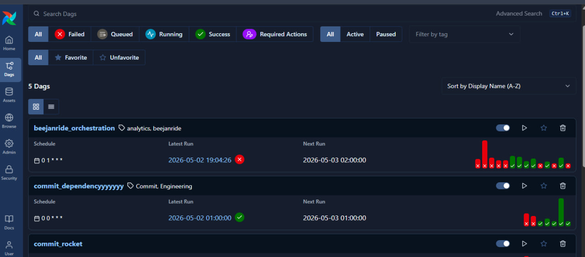
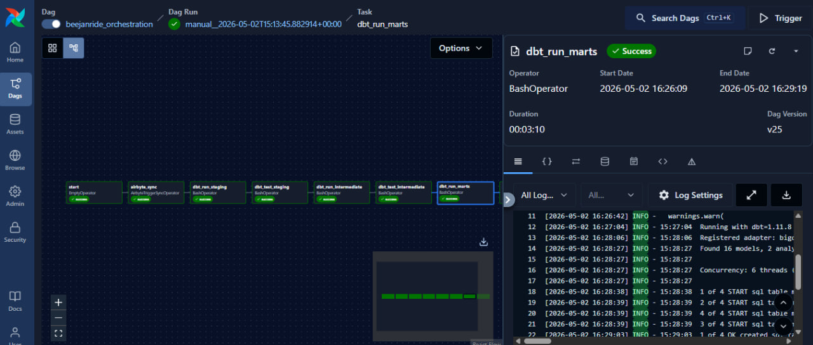
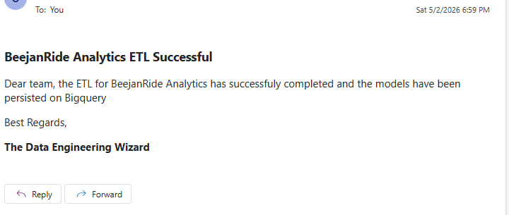
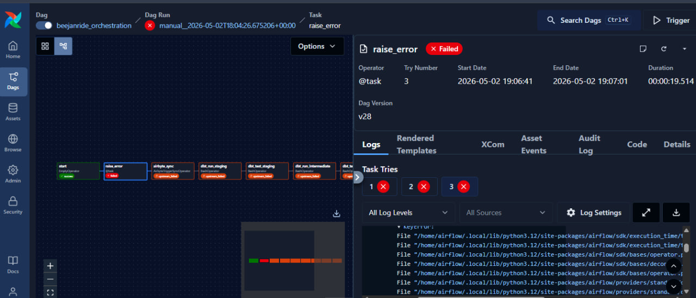
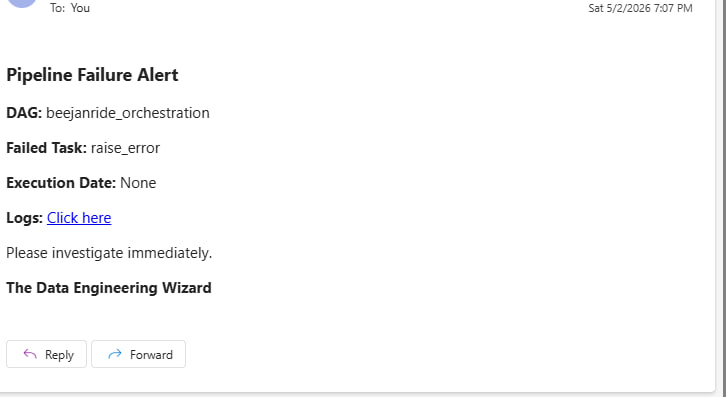
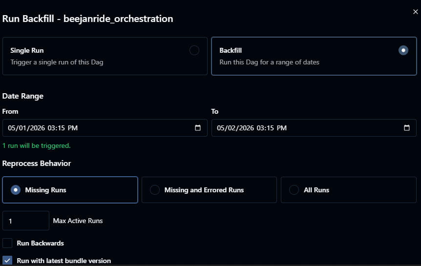
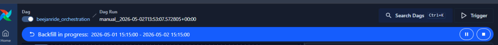
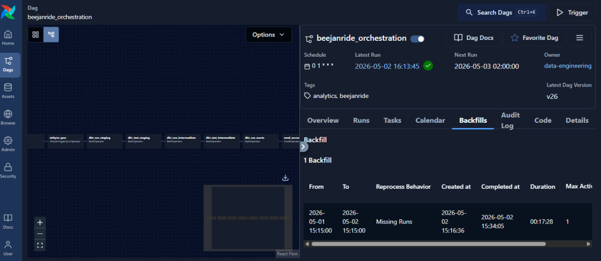

# BeejanRide Analytics Modelling Project
BeejanRide is a fast‑growing UK mobility startup operating in 5 cities, offering ride‑hailing, airport transfers, and scheduled corporate rides.
This project implements a scalable, well‑tested, documented, and production‑ready analytics platform using dbt on top of a modern data stack. Bigquery was used as the data warehouse.

### Project Structure

```
beejan_ride/
├── analysis/
├── macros/
├── models/                                   
├── seeds/
├── snapshots/
├── tests/
├── .gitignore
├── README.md
├── dbt_project.yml
│
├── Airflow/                            # Airflow orchestration layer
│   ├── dags/
│   │   └── beejanride_orchestration/
│   │       ├── beejanride_orchestration.py   # main DAG file
│   │       └── callbacks.py                  # failure callback (separated for clean concerns)
│   ├── docker-compose.yml
│   ├── requirements.txt
│   └── .env.example                          # mirror of my .env file
│
└── images/                                   # screenshots & diagrams
```

## Architectural Diagram



## Data Flow Illustration

### 1. Ingestion
- Source: postgres transactional database
- Tool: Airbyte used to ingest raw data into the data warehouse - Bigquery
- Raw Layer: Raw tables included trips_raw, drivers_raw, riders_raw, payments_raw, cities_raw, driver_status_events_raw. The tables are immutable i.e no modifications are allowed.
The raw layer was the ingested data into the bigquery dataset which was the entries of the transactional database that speaks to the BeejanRide platform.

Some of the decisions made during this workflow step included using incremental-Append for syncing data while using the primary keys on each table as the cursor as against using the Incremental| Append + Deduped which wasn't allowed for a trial account.  An automated sync was also enabled for every 1hr(the lowest that could be gotten for a trial account), to keep the data fresh as much as possible.


#### Generic Tests
Some of the generic tests done in the source.yml file included:
- unique
- not_null
- accepted_values
- relationships

### 2. Staging Layer

This workstep involved applying some cleaning and standardization to the ingested raw data on the data warehouse, which included:
- Renaming columns to snake_case.
- Casting to correct data types.
- Deduplication using primary keys.
- Standardizing timestamps and
- Removing invalid/null primary keys.

The models on the staging layer was build on the source tables by connection to the raw tables in the data warehouse by ensuring that the right parameters(name, database and schema was supplied, as well as the correct table names).
This is a link to the sources documentation from dbt docs

- [dbt docs -- sources](https://docs.getdbt.com/docs/build/sources?version=1.12)

### 3. Intermediate Layer
This was where majority of the heavy-lifting was done to suit the business use cases by enriching the staging data with the necessary business logic. Some of the column enrichments included but not limited to:
- trip_duration_minutes
- driver_lifetime_trips
- rider_lifetime_value
- corporate_trip_flag
- net_revenue calculation
- Fraud indicators: duplicate payments, failed payment on completed trip, extreme surge multiplier (>10).

This stage also involved the use of macros for reusable business logics such as calculating the trip_duration_minutes and net_revenue calculation. I also tweaked the dbt default macro of generate_schema_name to create schemas for staging, intermediate and marts. Macros in Jinja are pieces of code that can be reused multiple times – they are analogous to "functions" in other programming languages, and are extremely useful for repeated logics across multiple models.

Below is a link to the jinja and macros and custom_generate_schema sections on dbt docs website:
- [jinja and macro](https://docs.getdbt.com/docs/build/jinja-macros?version=1.12)
- [custom schemas](https://docs.getdbt.com/docs/build/custom-schemas?version=1.12)

### 4. Marts
This workstep involved organizing the data into a star schema with fact and dimension tables for easy BI consumption by building on the intermediate models.

- Fact Table: facts_trips (trip grain, measures + fraud flags).
- Dimensions: dim_drivers, dim_riders, dim_cities for extra attributes on the entities.

The lineage of the data models created can be found be running the commands:

```

    dbt docs generate

```

Then to display on a browser;

```

    dbt docs serve

```

### Lineage Graph


### ERD Diagram


## Snapshots
Other considerations included having a snapshot to track slowly changing dimensions(SCD) like driver status, vehicle assignments and rating updates. The default dbt SCD type 2 snapshot was used for the drivers on the drivers table which tracks the changes by introducing flags for everytime a change is done without inserting an additional record for the new row, but this was done on an ephemeral materialization so as to first carry out some transformations on the raw drivers table, without materializing it on the data warehouse before a snapshot is applied thereby saving compute cost and size.

Link to the snapshot documentation:
- [snapshots](https://docs.getdbt.com/docs/build/snapshots?version=1.12)


## Design Decisions
During the cause of the project, some design decisions were taken based on personal judgement and what is sensed to serve the business use case properly. Some of which included:
- Fraud Indicators in Fact: stored directly in facts_trips instead of having a separate model for fraud analysis. This was to allow for easier querying and eliminate repetition of steps.
- Single Facts Table: All facts measures consolided at the trip grain.
- Incremental Model: Used incremental models for high volume tables, so as to avoid the compute cost associated with full refresh. This of course reduces the build time in transforming new records by limiting the data that needs to be transformed and invariably reducing compute cost and improving warehouse performance everytime the model is run as against making use of full refresh. However, this comes with the drawback of requiring extra configuration.
- Metadata Governance: Owner and tags applied in marts layer only, keeping staging lean.

## Incremental Models vs Tables(Full refresh)
As previously stated, incremental models are useful for models requiring complex transformations and heavy data. This helps to transform just the new records that are added to the table using the rows that  in your source data that you tell dbt to filter for, inserting them into the target table which is the table that has already been built. Often, the rows you filter for on an incremental run will be the rows in your source data that have been created or updated since the last time dbt ran. As such, on each dbt run, your model gets built incrementally. This is done by adding a 'unique key' to the incremental model configuration. By doing this, the old records in the table are updated since the last run, while new unique records are inserted. In summary, it typically does a merge and insert command on bigquery.

Using an incremental model limits the amount of data that needs to be transformed, vastly reducing the runtime of your transformations. This improves warehouse performance and reduces compute costs. This often come at a cost of extra configurations in the setup and sometimes having to make do with delayed queues of new data.

Full refresh on the other hand is used for a model that has been materialized as a table on the data warehouse and is used to get dbt to rebuild the model again by dropping the table(albeit silently) and creating it again from scratch so as to have new records in the table. Tables are however very quick to query by BI tools as it is more or less static until, but this can take a long time to build especially those involving complex transformations.

Below is a link to the materialization sections on dbt docs:
- [Materializations](https://docs.getdbt.com/docs/build/materializations?version=1.12)
- [Incremental Models](https://docs.getdbt.com/docs/build/incremental-models?version=1.12)

## Custom Tests
Additional data quality checks included building custom tests that speaks to specific business logics such as ensuring there was no negative revenue, completed trips has a valid payment and trip duration minutes for completed trips was always greater than zero minutes. Further guidance on custom tests can be found on the dbt documentation page using the link below:

- [singular data test](https://docs.getdbt.com/docs/build/data-tests?version=1.12)

## Orchestration with Apache Airflow

### Overview

BeejanRide now runs the entire ELT pipeline automatically in production using Apache Airflow as the orchestration layer. Nothing is triggered manually — Airflow schedules, monitors, retries, and alerts on every run end to end.

### Pipeline Flow
 
The DAG runs automatically every day at 01:00 UTC following this task sequence:

```
airbyte_sync
    → dbt_run_staging      → dbt_test_staging
    → dbt_run_intermediate → dbt_test_intermediate
    → dbt_run_marts        → send_success_email
```

A deliberate design decision was made to test each dbt layer immediately after it runs rather than testing everything at the end. This ensures that a failure in staging stops the pipeline before bad data can propagate into intermediate or marts, enforcing data quality at every layer.

### DAG Screenshots

#### Airflow UI Dags View

The image below shows the view of DAGS in the Airflow UI


#### Successful DAG Run & Email Notification

The images below show successful Dag run as well as the email alert sent on a successful ELT run




#### Failed DAG Run & Email Notification

The images below show failed Dag run as well as the email alert sent on a failed ELT run which was triggered
by the on_failure_callback dag default argument.




#### Backfill Initialization, Execution and Completion

The images below show the point of initializing the Dag for backfills (in case of missed dag runs), during execution
and when the backfill execution was successfully completed (which includes details of the timeframe - from and to period
for the backfill and the duration it took for the run to be completed).







### Key Design Decisions

**Scheduling**

The DAG is scheduled to run at 1 am everyday using the cron expression `0 1 * * *` . This is to prevent manual
triggers at any point. The pipeline runs fully automatically in production.
 
**Retries**

Every task is configured with 3 retries and a 15-second retry delay which is exponentially increased between each failed attempt
i.e the wait period for a retry is doubled with respect to the retry delay period of the previously failed attempt, therefore giving the 
failed task ample time to recover from any minor glitch that must have resulted in the task failing which includes transient failures such as network timeouts, temporary Airbyte unavailability, or brief BigQuery disruptions, without requiring any human intervention.

**Failure Handling**

A custom `on_failure_callback` defined in a dedicated `callbacks.py` file fires automatically whenever any task in the DAG fails. It sends an email alert containing the DAG name, the failed task ID, the execution date, and a direct link to the task logs for quick debugging. Separating this into its own file keeps the main DAG clean and makes the callback reusable across multiple DAGs in future.
 
**Testing Per Layer**

dbt tests run immediately after each individual layer — staging, intermediate — rather than once at the very end of the pipeline.
This means a data quality issue is caught at the earliest possible point and downstream layers are never built on top of bad data.

**Separation of Concerns**

The failure callback logic lives in its own `callbacks.py` file rather than inline in the DAG. The alert email address is stored as an environment variable (`ALERT_EMAIL`) in a `.env` file and never hardcoded, ensuring no sensitive information is exposed when pushing
to GitHub.

**Backfills**

`catchup=True` is configured on the DAG, meaning Airflow will automatically backfill any scheduled runs that were missed if the pipeline was down. Backfills can also be triggered manually via the Airflow UI when needed.

**Monitoring**

The DAG includes descriptive tags (`beejanride`, `analytics`), a `doc_md` docstring visible in the Airflow UI, and email alerts for both success and failure thereby giving full visibility into every run without needing to log into the Airflow UI manually.

### Idempotency In Airflow

This means that running the same pipeline dag multiple times produces the same result with no duplicate data and no side effects from re-runs. Whether the DAG runs once or ten times for the same time period, the output should always be identical.
In this project, the dag argument max_active_runs=1 on the DAG ensures that only one DAG run can execute at any given time. If a scheduled run is still in progress when the next one is due to start, the new one waits. This prevents two runs from writing to the same BigQuery tables simultaneously, which would cause data corruption or duplication.

### Running Locally with Docker
 
**Prerequisites**

- Docker & Docker Compose installed
- A `.env` file configured based on `.env.example`
- A Google Cloud service account JSON key file

**Start Airflow**

```bash
cd Airflow && docker compose up -d
```
 
**Access the Airflow UI**

```
URL:      http://localhost:8080
Username: airflow
Password: airflow
```
 
### Connections to configure in the Airflow UI

- `airbyte_conn`: This was done using the airbyte cloud api by following the steps listed below: 
    - On the Airflow UI, navigate to Admin ---> Connections
    - On the Top Right, click on "Add Connection"
    - Connection ID - "airbyte_conn" (Or any name you desire)
    - Connection Type - Airbyte (More details about this under challenges)
    - Standard Fields
        - description: Give it any befitting description(optional)
        - Host: https://api.airbyte.com/v1/
        - Client ID: Go to your airbyte cloud connection page, navigate to user profile(bottom left) and click on Applications --? Create/Add Application and add a name e.g Airflow sync. Then Copy the Client ID and Client Secret
        - Client Secret: Gotten from Airbyte Cloud Connection
        - Token URL: v1/applications/token (Optional Field)
    - Extra Fields: Leave Blank

Learn More Here using the official docs: [Airbyte Connection with Airflow](https://airflow.apache.org/docs/apache-airflow-providers-airbyte/stable/operators/airbyte.html)

Also note that you must have apache-airflow-providers-airbyte installed on your container instance or environment(if not using airflow running in docker) to have access to the Airbyte Provider(Connection Type) by running:

```bash
 pip install pip install apache-airflow-providers-airbyte
```
NB: Details on the challenges I faced on this and how it was resolved under Challenges and Resolutions

NB: Connecting Airflow with Airbyte running on a container on Local Host is slightly different. You can get a some tips from this Medium post: [Orchestrate Airbyte Using Apache Airflow by Rajesh Ku. Rout](https://medium.com/apache-airflow/orchestrate-airbyte-using-apache-airflow-f410e7c8eb02)

NB: Irrespective of the airbyte method used, to get your connection ID to be used in your DAG file, simply go to the URL of your airbyte connection and copy the alphanumeric digits in between the forward slashes after 'connection'(in the URL).


- `smtp` — This was done using the SMTP connection for email alerts by following the steps listed below:
    - On the Airflow UI, navigate to Admin ---> Connections
    - On the Top Right, click on "Add Connection"
    - Connection ID - "smtp" (Or any name you desire)
    - Connection Type - SMTP
    - Standard Fields
        - description: Give it any befitting description(optional)
        - Host: smtp.gmail.com (If trying to configure for the gmail server for the sender email)
        - Login: The email address of the sender email(e.g your_email@gmail.com)
        - Password: To get the unique password that gains access to your email, go to myaccount.google.com. Navigate to Security and then "App passwords" and name it Airflow(or anything). A unique 16-character password will be generated by google. Copy that and use as the password.
        - Ports: 465 (This is the port for SSL Connection)
    - Extra Fields:
        - From email: your_email@gmail.com(This can also be specified in your task instance in  your dag file)
        - Disable TLS: Toggle this on since SSL was used
        ... leave other parameters as default

NB: The smtp connection is then used in the send email notification task instance using the connection id "smtp" (As specified in the UI).

### Challenges and Resolutions

The orchestration project with apache airflow went beyond just orchestrating tasks for me as it tested and reinforced my understanding of linux, containerization using docker and troubleshooting ny studying logs. Listed and explained below were some of the challenges I faced and how I was able to get them resolved:

- Installing apache-airflow-providers-airbyte: I had issues seeing my airbyte provider amongst the providers even after running the command:

```bash
 pip install pip install apache-airflow-providers-airbyte
```
My dag file kept having a Dag Import Error with the error message "Module Named airflow.providers.airbyte.operators.airbyte not found" This was as a result of my airbyte provider getting installed in my venv environment but not being installed into my airflow container instances during build time. The providers installed at build time were the default airflow standard providers and plugins as indicated in the docker-compose.yaml file, so I had to find a way to install the packages I need inside each airflow container instances during the build time.

NB: I had this issue because I was running the Airflow instances on docker. This doesn't surface when not using a containerized Airflow (e.g Airflow installed using pip install in wsl or ubuntu).

This was reslved by creating a requirements.txt file and listing all the packages I want installed in each containers and then mounting the requirements.txt file path as a volume e.g

```bash
 # Just added this line for it to automatically also install from my requirements.txt
    - ${AIRFLOW_PROJ_DIR:-.}/requirements.txt:/requirements.txt
```
Then in each services(api-server, scheduler etc), the command was forced to first install the packages from the requirements.txt file before starting the services. An example of how that was done in the compose.yaml is shown below:

```bash
command: bash -c "pip install --no-cache-dir -r /requirements.txt && exec airflow api-server"

command: bash -c "pip install --no-cache-dir -r /requirements.txt && exec airflow scheduler"
```

After then, the containers were stopped and restarted using the commands:

```bash
 docker compose down && docker compose up --build -d
```

NB: This made the start time of each container instances really slow as they had to first install from the requirements.txt file before starting the container services. The logs of everything could be seen by checking the logs of one of the containers using:

```bash
 docker logs airflow-airflow-scheduler-1
```

- Pointing Airflow Instance to local dbt project: The first challenge I encounted was how to make my dbt project which was domiciled on my Windows Host visible to my Airflow container instance ( Recall containers are isolated environments which by default has no access to local system paths). Here the knowledge of volumes in docker came into play. I bind mounted my dbt project path to a path inside my airflow container so that my airflow instance will have access to that local host path and resources docimiciled there. This was done under the volumes section in the docker-compose.yaml file. Subsequent references that required the project path in the dag file made use of the container path and not the host path.
Another mistake I made during bind mounting was mounting my .dbt/ local path to /opt/airflow/.dbt container path which constantly made my dbt tasks to fail in my airflow UI with the error message that /home/airflow/.dbt was not found as it checks that path by default. I had to change my conatiner path to /home/airflow/.dbt. Examples of the mounted volumes are shown below:

```bash
        # DBT Project Mount
        - /c/Users/HP/beejanride_dbt_project/beejan_ride:/opt/airflow/beejanride_dbt_project
        - /c/Users/HP/data_engineering_mastery/dbt_process/dbt_learn_osas:/opt/airflow/dbt_learn_osas

        # DBT profiles.yaml path Mount
        - /c/Users/HP/.dbt:/home/airflow/.dbt
```
To verify and check what could be seen inside the container, you can exeucute into one of the containers and run linux commands like ls, cd, cat etc using:

```bash
 docker exec -it airflow-airflow-scheduler-1 bash
```

- Container, Linux and Windows file path mismatch: After my airbyte provider was resolved and the host file paths was properly mounted to a container file path, the dbt tasks kept failing with the error message "/home/airflow/.dbt does not exist" even after the .dbt/ directory could be found when I execute into one of the container and navigate to that file path i.e /home/airflow/.dbt and the profiles.yaml file found in that directory. It turned out that because the keyfile path in my profiles.yaml (that is the path to my service account json key) was in Windows format e.g  C:\Users\HP\beejanride_dbt_project\beejanride-488809-e72664339e39.json thereby while the container service expected a container file path (Note: I initially changed it into a linux file path e.g /c/Users/beejanride_dbt_project/beejanride-488809-e72664339e39.json but it still failed). The final resolution was to change the path to a conatiner file path e.g /opt/airflow/beejanride_dbt_project/beejanride-488809-e72664339e39.json before it worked as the conatiner service could only understand the conatiner file path.
NB: This was done in my .dbt/profiles.yaml inside my local host and the changes immediately reflected inside the container path because it was mounted to it and changes to that path in the local host gets seen inside the container - the beauty and power of volumes.

Finally, I could run test dbt commands inside my container to be sure that it will run and will no longer fail in my Airflow UI with test commands like:

```bash
    dbt run --select staging \
  --project-dir /opt/airflow/beejanride_dbt_project \
  --profiles-dir /home/airflow/.dbt
```

This finally executed the dbt command successfuly.

- Using env variables for my email address: I needed to make a tweak to my DAG file after it was running successfully end-to-end after it was running successfully such that instead of hardcoding my email address for alerts, I needed to put it inside the .env file and pass it to a variable in my dag file so that it gets used at the task instances runtime. This started to fail as my newly added parameter in my .env file was not found by the services as the initial values was already loaded at start up. I had to add the email variable to the environment section in the docker-compose.yaml file and then restarted the container so as to include the environment variable at the start up of the conatainers using:


```bash
    docker compose down && docker compose up --build -d   
```
An example of how the environment was done is seen below:

```bash
    environment:
        &airflow-common-env
        AIRFLOW__CORE__EXECUTOR: LocalExecutor
        ...
        ALERT_EMAIL: ${ALERT_EMAIL}
```

## Future Improvements
- Adding a vehicle dimension table with attributes such as vehicle type, licence number,
  and model — a vehicle ID is already present in the fact table.
- Adding a data freshness check task before dbt runs to confirm Airbyte ingestion succeeded.
- Slack notifications in addition to email alerts for faster team response.
- A monitoring dashboard for DAG run history and SLA breach tracking.

## Sample Analytical Queries
Some of the analytical queries that can be used to get reporting insights from the final serving models includes:

### TOP DRIVERS BY REVENUE
```
    select
        d.driver_id
        , d.city_id
        , d.rating
        , sum(f.net_revenue) as total_driver_revenue
    from {{ ref('facts_trips') }} f
    join {{ ref('dim_drivers') }} d
    on f.driver_id = d.driver_id
    where f.status = 'completed'
    group by d.driver_id, d.city_id, d.rating
    order by total_driver_revenue desc
    limit 10
```

### FRUAD DETECTION INSIGHTS

```
select
    f.trip_id,
    f.city_id,
    f.driver_id,
    f.rider_id,
    f.duplicate_payment_flag,
    f.failed_payment_on_completed_trip,
    f.extreme_surge_flag
from {{ ref('facts_trips') }} f
where f.duplicate_payment_flag = 'Y'
    or f.failed_payment_on_completed_trip = 'Y'
    or f.extreme_surge_flag = 'Y'
```
These could be found on the analyses directory.


### SETUP
**1** Create a project directory on vscode and then create and activate python environment using:

```

    python -m venv .venv

```

activate:

```

    source venv/Scripts/activate

```

**2** While in the environment, install dbt-core and bigquery adapter(or the adapter of any data warehouse you want to use) by running the command:
```

    python -m pip install dbt-core dbt-bigquery

```

**3** Sign in to the [GCP platform](console.cloud.google) and create a new project

**4** Navigate to or search for Bigquery and then create a service account(A service account route was used for authentication in the case because billing is not enabled and it is a free account)

**5** Enable the Big Data Editor and Bigquery User roles for this service account and click on done.

**6** Click on the created service account and navigate to keys, add key-json format. This automaticallly downloads the key as a json file. Copy this and paste in your project directory at the same location where the virtual environment folder is located.

**7** In your bigquery project on gcp, create a dataset with a valid dataset name and a dataset location.

**8** On the bash terminal, with the virtual environment activated run this to initialialize the dbt boostrapper.

```

    dbt init

```

Follow the prompts and provide the right responses such as dbt project name, bigquery for database,service account for authenticatication method, json key file path(just right-click on the json key in your project directory and copy the full file path), ensure you choose the same location as your dataset on bigquery and click on enter button to select default values for some prompts where applicable e.g job execution timeout seconds.
When completed, dbt creates a new dbt directory with some other sub-directories like seeds, macros, models, tests, etc

A .dbt file is also created outside of the parent directory and when navigated into, the cnnection details to the data warehouse can be found. This is editable in case of any corrections that needs to be made.

**9** Testing the dbt connection
Navigate to the created dbt project directory after initialization and run the command:

```

    dbt debug

```

This shows passed when the connection is done right.


### CONTRIBUTIONS
Feel free to make corrections, provide recommendations and other necessary contributions to scale up this project. Best Regards...
